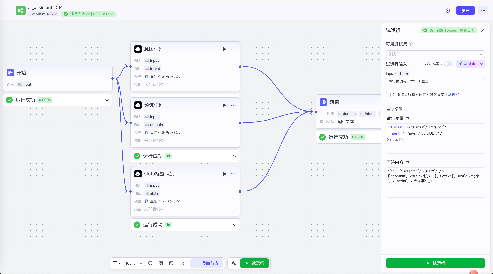

## 作业1:  
autodl账号id 提交为作业，方面老师共享镜像。（本地有环境的，可以不用提供，这个不是必须的，也不需要提交）
 
## 作业2:  
使用讲解大模型开发流程（提示词、tools、coze/dify）尝试写一下解决意图识别 + 领域识别 + 实体识别的过程。最终效果替代02-joint-bert-training-only
可以优先使用coze，不部署dify。
- 提示词方案代码
  [prompt](./semantic_parser_prompt.py)
- tools方案代码
  [tools](./semantic_parser_tools.py)  
  **总结**：  
  这里有个小问题，slots太多，本方案设计成了两阶段处理方式。  
  首先，基于对业务的理解，以及对train数据的观察，将领域与slots做了映射。  
  第一阶段：判断领域与意图； 
  第二阶段，根据领域获取可能的slots，再抽取slots。  
  这样做的**好处**是，定义basemodel方便，且提高模型反应速度；
  **问题**是，领域的结果会影响slots的结果，比如poetry的相关的text会被判定为music，而poetry与music对应的slots又不同，导致结果出现偏差。
   
- coze 实现截图
 
## 作业3:  
把作业2完成的提示词 + tools的代码，使用fastapi部署。
- 部署代码
  [app](./app.py)
- 部署效果截图
  
